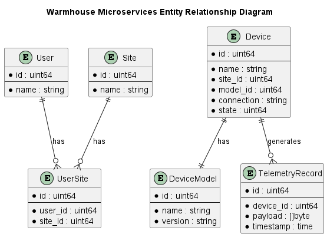
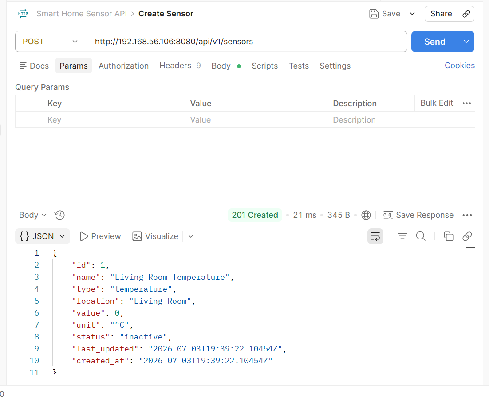
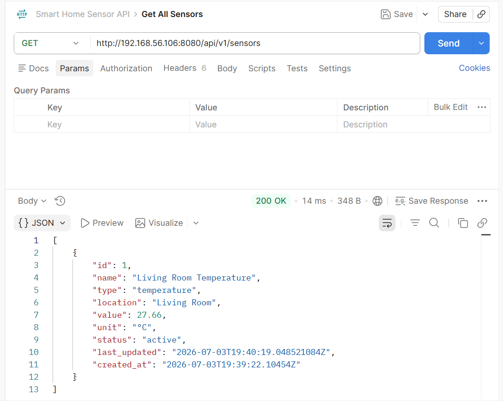
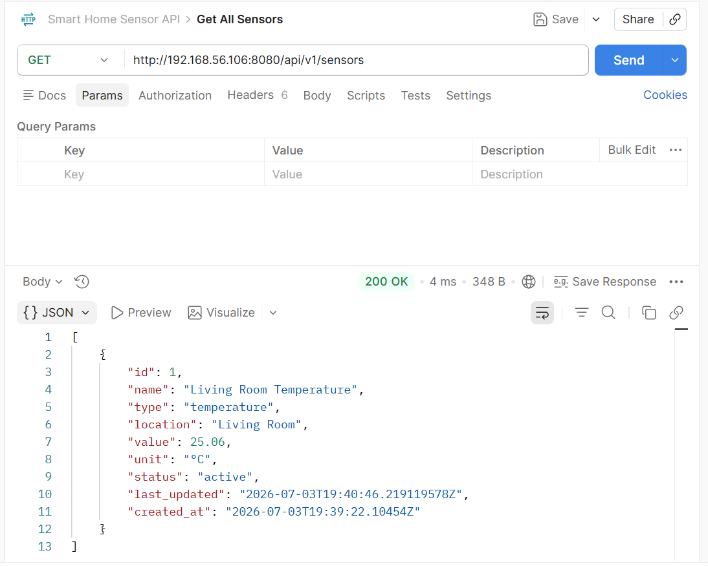

# Warmhouse

# Задание 1. Анализ и планирование

### 1. Описание функциональности монолитного приложения

Функционал в коде не совсем соответствует заявленному, поэтому см. также раздел "Проблемы монолитного решения"

**Управление отоплением:**

- Пользователи (администраторы?) могут
    - добавлять / редактировать / удалять сенсоры

- Пользователи могут
    - Выставлять желаемую температуру в доме
    - Выставлять статус (вкл/выкл?) отопления

**Мониторинг температуры:**

- Пользователи могут
    - Получать список сенсоров с их текущими температурами
    - Получать температуру в локации (комнате?)

### 2. Анализ архитектуры монолитного приложения

Язык - Go  
БД - PostrgreSQL

Custom компонент в коде один - это монолитный бэкенд системы. Он предоставляет свой API по HTTP/REST. С внешним API мониторинга температуры он тоже общается по HTTP/REST. Наличие UI (admin и end-user) видимо подразумевается - см. раздел "Проблемы монолитного решения".

API температуры - внешнее API, умеет работать с сенсорами-устройствами.

### 3. Определение доменов и границы контекстов

AsIs:

* домен: управление сенсорами
  * поддомен: регистрация / удаление сенсоров
    * контекст: регистрация / удаление сенсоров
  * поддомен взаимодействие с сенсорами
    * контекст: выдача команд сенсорам
    * контекст: сбор телеметрии с сенсоров

ToBe:

* домен: управление устройствами
  * поддомен: регистрация (самостоятельная) / удаление устройств
    * контекст: регистрация (самостоятельная) / удаление устройств
  * поддомен взаимодействие с устройствами
    * контекст: выдача команд устройствам
    * контекст: сбор телеметрии с устройств

* домен: управление локациями
  * поддомен: добавление / удаление локаций

* домен: управление пользователями
  * поддомен: управление пользователями
    * контекст: регистрация новых / деактивация / удаление пользователей

* домен: управление подпиской на сервис (платежи и тп) - out of scope

* домен: клиентский сервис - out of scope

### 4. Проблемы монолитного решения

#### 1. Out of scope?

Сказано, что "Самостоятельно подключить свой датчик к системе пользователь не может." - видимо подразумевается, что есть некий администратор, который это делает, но UI для этого в системе отсутствует - видимо out of scope примера. Ручки работы с сенсорами есть.

То же самое про UI для пользователя - тоже видимо out of scope примера.

API температуры содержит только ручки получения температуры, но не умеет выдавать команды управления отоплением - тоже видимо out of scope примера, см. ниже.

Сущность "Пользователь" в системе никак не представлена, нет ролей и модели доступа, ручки работы с сенсорами позволяют работать вообще с любым сенсором (в чужом доме?).

Есть сущность location, но это просто характеристика сенсора - локации никак не связаны ни с пользователями ни друг с другом.

#### 2. Недостатки монолита (реализация)

Даже если предположить, что наличие всех компонент подразумевается и просто out-of-scope примера:

Не совсем ясна семантика работы с сенсорами. С одной стороны, получая данные по сенсорам мы получаем текущую температуру из temperature-api. А вот что делает UpdateSensorValue не совсем ясно - скорее всего это имитация команды на сенсор "выставить определённую температуру". Хотелось бы чётче разделить понятия "желаемая температура" и "фактическая температура".

У сенсора есть свойство location, а помимо этого в API температуры можно получить значения температуры по ID сенсора и по локации. Видимо подразумевается, что локация-сенсор - отношение один к одному (на это есть намёк в примере кода Задания 5). Это тоже выглядит не слишком логичным, в теории можно мерять температуру в нескольких точках одного и того же location - это если локация имеет смысл "помещение" и тп. Если же location просто alias для ID сенсора, то наверно его надо назвать как-то более обще.

Ручка получения сенсоров и одного сенсора имеет смешанный функционал - получает сенсор из БД и заодно синхронно получает текущую температуру. Помимо того, что это может быть просто не нужно (я просто хочу получить список сенсоров и температура мне не интересна), такое решение плохо масштабируется (если у меня 10 сенсоров в доме - я буду опрашивать их последовательно) и затрудняет реализацию кейсов "поставить алерт на событие 'Ваш хомяк скоро зажарится'" или "удерживать температуру в 23 градуса" (если это не предусмотрено самим устройством).

#### 2. Недостатки монолита (архитектура)

С какого-то момента начнутся проблемы с монолитом в части развёртывания. Добавили поле в БД с новым свойством сенсора, запустилась миграция на час, а конечный пользователь не может убавить температуру в доме. Будет ещё хуже, когда система научится открывать-закрывать двери - к пользователю пришли гости в два часа ночи, его нет дома, он не может открыть дверь гостям тк у нас релизится монолит.

Развивать решение тоже будет тяжело - единственный сервис начнёт содержать знания обо всех типах устройств и тп.

С точки зрения масштабируемости - у разного функционала будут разные требования к масштабируемости - количество конечных пользователей и сенсоров будет быстро расти, а вот функционал admin UI (всё равно в нём что-то останется даже после реализации кейса самостоятельного добавления устройства - возможны кейсы, когда заведением учётных записей заведует например управляющая компания) будет расти не так быстро - это тоже создаст проблемы с обновлением и с излишними требованиями к ресурсам (тк мы всегда будем увеличивать количество экземпларов монолита с полным функционалом).

### 5. Визуализация контекста системы — диаграмма С4

# Задание 2. Проектирование микросервисной архитектуры

В этом задании вам нужно предоставить только диаграммы в модели C4. Мы не просим вас отдельно описывать получившиеся микросервисы и то, как вы определили взаимодействия между компонентами To-Be системы. Если вы правильно подготовите диаграммы C4, они и так это покажут.

#### Out of scope:

Accounting - система не бесплатная?
Аналитика - хранить и анализировать события от устройств в исторической перспективе
Клиентский сервис - у пользователя что-то не работает - куда он пишет

**Диаграмма контейнеров (Containers)**

**Диаграмма компонентов (Components)**

**Диаграмма кода (Code)**

Добавьте одну диаграмму или несколько.

# Задание 3. Разработка ER-диаграммы

User может иметь несколько Site (квартир, домов).

У Site может быть более одного User (более одного собственника / проживающего и тп).

У Device помимо очевидных атрибутов есть connection - это нечто, что позволяет сервисам общаться с устройством по их протоколу - типа connection string, протокол определяется моделью и версией устройства.

# Задание 4. Создание и документирование API

### 1. Тип API

Укажите, какой тип API вы будете использовать для взаимодействия микросервисов. Объясните своё решение.

### 2. Документация API

Здесь приложите ссылки на документацию API для микросервисов, которые вы спроектировали в первой части проектной работы. Для документирования используйте Swagger/OpenAPI или AsyncAPI.

# Задание 5. Работа с docker и docker-compose

### Вызов Create Sensor

### Вызов Get All Sensors

### Повторный вызов Get All Sensors

# **Задание 6. Разработка MVP**

Необходимо создать новые микросервисы и обеспечить их интеграции с существующим монолитом для плавного перехода к микросервисной архитектуре. 

### **Что нужно сделать**

1. Создайте новые микросервисы для управления телеметрией и устройствами (с простейшей логикой), которые будут интегрированы с существующим монолитным приложением. Каждый микросервис на своем ООП языке.
2. Обеспечьте взаимодействие между микросервисами и монолитом (при желании с помощью брокера сообщений), чтобы постепенно перенести функциональность из монолита в микросервисы. 

В результате у вас должны быть созданы Dockerfiles и docker-compose для запуска микросервисов. 