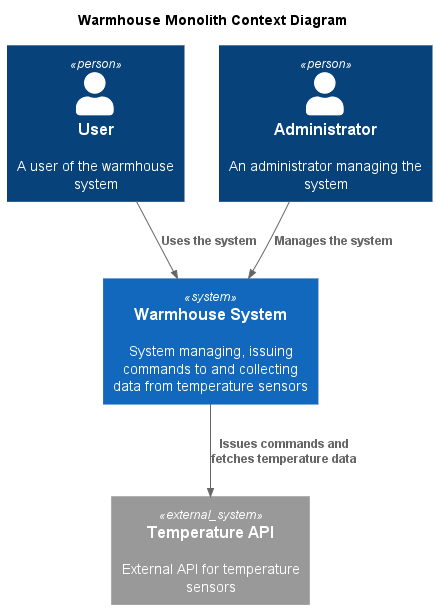
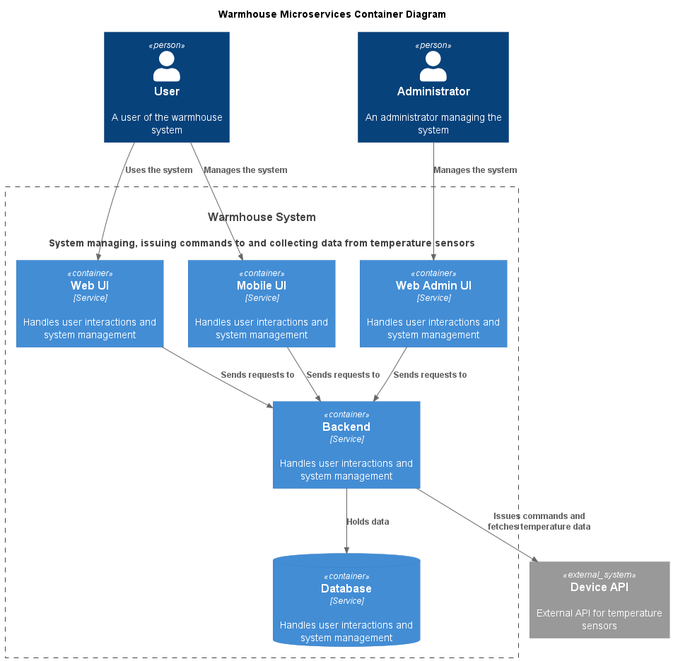
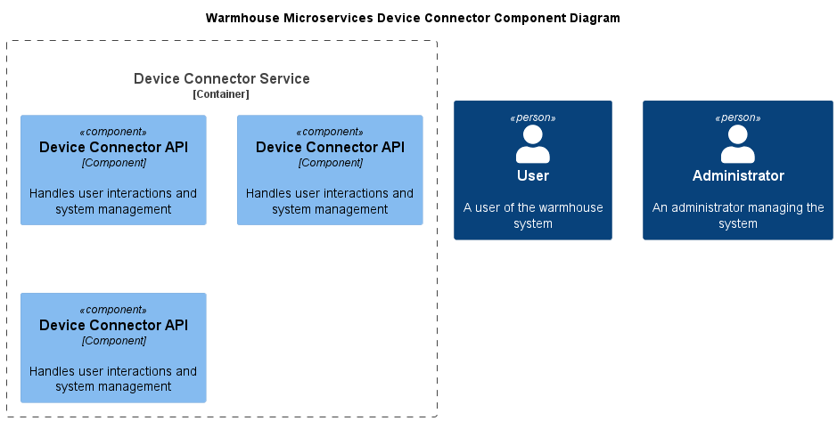

# Warmhouse


# Задание 1. Анализ и планирование

### 1. Описание функциональности монолитного приложения

Функционал в коде не совсем соответствует заявленному, поэтому см. также раздел "Проблемы монолитного решения"

**Управление отоплением:**

- Пользователи (администраторы?) могут
    - добавлять / редактировать / удалять сенсоры

- Пользователи могут
    - Выставлять желаемую температуру в доме
    - Выставлять статус (вкл/выкл?) отопления

**Мониторинг температуры:**

- Пользователи могут
    - Получать список сенсоров с текущими температурами
    - Получать температуру в локации (комнате?)

### 2. Анализ архитектуры монолитного приложения

Язык - Go  
БД - PostrgreSQL

Custom компонент в коде один - это монолитный бэкенд системы. Он предоставляет свой API по HTTP/REST. С внешним API мониторинга температуры он тоже общается по HTTP/REST. Наличие UI (admin и end-user) видимо подразумевается - см. раздел "Проблемы монолитного решения".

API температуры - внешнее API, умеет работать с сенсорами-устройствами.

### 3. Определение доменов и границы контекстов

AsIs:

* домен: управление сенсорами
  * поддомен: регистрация / удаление сенсоров
    * контекст: регистрация / удаление сенсоров
  * поддомен взаимодействие с сенсорами
    * контекст: выдача команд сенсорам
    * контекст: сбор телеметрии с сенсоров

ToBe:

* домен: управление устройствами
  * поддомен: регистрация (самостоятельная) / удаление устройств
    * контекст: регистрация (самостоятельная) / удаление устройств
  * поддомен взаимодействие с устройствами
    * контекст: выдача команд устройствам
    * контекст: сбор телеметрии с устройств

* домен: управление локациями
  * поддомен: добавление / удаление локаций

* домен: управление пользователями
  * поддомен: управление пользователями
  * контекст: регистрация новых / дективация / удаление пользователей

* домен: управление подпиской на сервис (платежи и тп) - out of scope

* домен: клиентский сервис - out of scope

### 4. Проблемы монолитного решения

#### 1. Строго говоря, решение не реализует то, что заявлено

Сказано, что "Самостоятельно подключить свой датчик к системе пользователь не может." - видимо подразумевается, что есть некий администратор, который это делает, но UI для этого в системе отсутствует - видимо out of scope примера. Ручки работы с сенсорами есть.

То же самое про UI для пользователя - тоже видимо out of scope примера.

API температуры содержит только ручки получения температуры, но не умеет выдавать команды управления отоплением - тоже видимо out of scope примера.

Сущность "Пользователь" в системе никак не представлена, нет ролей и модели доступа, ручки работы с сенсорами позволяют работать вообще с любым сенсором (в чужом доме?).

Есть сущность location, но это просто характеристика сенсора - локации никак не связаны ни с пользователями ни друг с другом.

#### 2. Недостатки помимо пункта выше - функционал

Даже если предположить, что наличие всех компонент подразумевается и просто out-of-scope примера:

Сенсор в коде - очень странная сущность - он сочетает в себе управление отоплением и измерение температуры. На первый взгляд, логично было бы, чтобы устройство управлением температурой было бы устройством одного типа, а сенсор (устройство, снимающее показатели) - другого.

У сенсора есть свойство location, а помимо этого в API температуры можно получить значения температуры по ID сенсора и по локации. Видимо подразумевается, что локация-сенсор - отношение один к одному (на это есть намёк в примера кода Задания 5). Это тоже выглядит не слишком логичным, в теории можно мерять температуру в нескольких точках одного и того же location (хотя смотря что считать location).

Ручка получения сенсоров и одного сенсора имеет смешанный функционал - получает сенсор из БД и заодно синхронно получает текущую температуру. Помимо того, что это может быть просто не нужно (я просто хочу получить список сенсоров и температура мне не интересна), такое решение плохо масштабируется (если у меня 10 сенсоров в доме - я буду опрашивать их последовательно) и затрудняет реализацию кейсов "поставить алерт на событие 'Ваш хомяк скоро зажарится'" или "удерживать температуру в 23 градуса".

#### 2. Недостатки помимо пункта выше - нефункциональные требования

С какого-то момента начнутся проблемы с монолитом в части развёртывания. Добавили поле в БД с новым свойством сенсора, запустилась миграция на час, а конечный пользователь не может убавить температуру в доме. Будет ещё хуже, когда система научится открывать-закрывать двери - к пользователю пришли гости в два часа ночи, его нет дома, он не может открыть дверь гостям тк у нас релизится монолит.

Развивать решение тоже будет тяжело - единственный сервис начнёт содержать знания обо всех типах датчиков и тп.

С точки зрения масштабируемости - у разного функционала будут разные требования к масштабируемости - количество конечных пользователей и сенсоров будет быстро расти, а вот функционал admin UI (в всё равно нём что-то останется даже после реализации кейса самостоятельного добавления устройства) будет расти не так быстро - это тоже создаст проблемы с обновлением и с излишними требованиями к ресурсам (тк мы всегда будем увеличивать количество экземпларов монолита с полным функционалом).

### 5. Визуализация контекста системы — диаграмма С4



# Задание 2. Проектирование микросервисной архитектуры

В этом задании вам нужно предоставить только диаграммы в модели C4. Мы не просим вас отдельно описывать получившиеся микросервисы и то, как вы определили взаимодействия между компонентами To-Be системы. Если вы правильно подготовите диаграммы C4, они и так это покажут.

#### Out of scope:

Accounting - система не бесплатная?
Аналитика - хранить и анализировать события от устройств в исторической перспективе
Клиентский сервис - у пользователя что-то не работает - куда он пишет

**Диаграмма контейнеров (Containers)**



**Диаграмма компонентов (Components)**



**Диаграмма кода (Code)**

Добавьте одну диаграмму или несколько.

# Задание 3. Разработка ER-диаграммы

Добавьте сюда ER-диаграмму. Она должна отражать ключевые сущности системы, их атрибуты и тип связей между ними.

# Задание 4. Создание и документирование API

### 1. Тип API

Укажите, какой тип API вы будете использовать для взаимодействия микросервисов. Объясните своё решение.

### 2. Документация API

Здесь приложите ссылки на документацию API для микросервисов, которые вы спроектировали в первой части проектной работы. Для документирования используйте Swagger/OpenAPI или AsyncAPI.

# Задание 5. Работа с docker и docker-compose

Перейдите в apps.

Там находится приложение-монолит для работы с датчиками температуры. В README.md описано как запустить решение.

Вам нужно:

1) сделать простое приложение temperature-api на любом удобном для вас языке программирования, которое при запросе /temperature?location= будет отдавать рандомное значение температуры.

Locations - название комнаты, sensorId - идентификатор названия комнаты

```
	// If no location is provided, use a default based on sensor ID
	if location == "" {
		switch sensorID {
		case "1":
			location = "Living Room"
		case "2":
			location = "Bedroom"
		case "3":
			location = "Kitchen"
		default:
			location = "Unknown"
		}
	}

	// If no sensor ID is provided, generate one based on location
	if sensorID == "" {
		switch location {
		case "Living Room":
			sensorID = "1"
		case "Bedroom":
			sensorID = "2"
		case "Kitchen":
			sensorID = "3"
		default:
			sensorID = "0"
		}
	}
```

2) Приложение следует упаковать в Docker и добавить в docker-compose. Порт по умолчанию должен быть 8081

3) Кроме того для smart_home приложения требуется база данных - добавьте в docker-compose файл настройки для запуска postgres с указанием скрипта инициализации ./smart_home/init.sql

Для проверки можно использовать Postman коллекцию smarthome-api.postman_collection.json и вызвать:

- Create Sensor
- Get All Sensors

Должно при каждом вызове отображаться разное значение температуры

Ревьюер будет проверять точно так же.


# **Задание 6. Разработка MVP**

Необходимо создать новые микросервисы и обеспечить их интеграции с существующим монолитом для плавного перехода к микросервисной архитектуре. 

### **Что нужно сделать**

1. Создайте новые микросервисы для управления телеметрией и устройствами (с простейшей логикой), которые будут интегрированы с существующим монолитным приложением. Каждый микросервис на своем ООП языке.
2. Обеспечьте взаимодействие между микросервисами и монолитом (при желании с помощью брокера сообщений), чтобы постепенно перенести функциональность из монолита в микросервисы. 

В результате у вас должны быть созданы Dockerfiles и docker-compose для запуска микросервисов. 